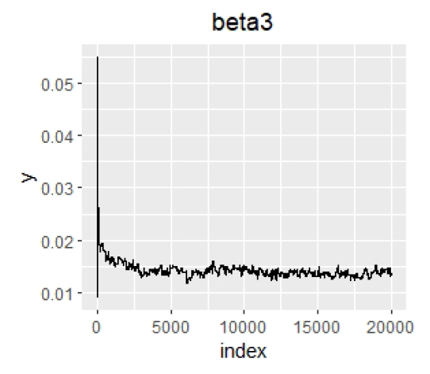
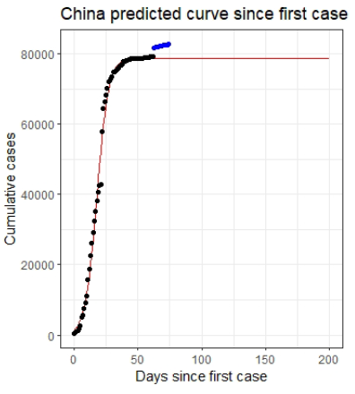
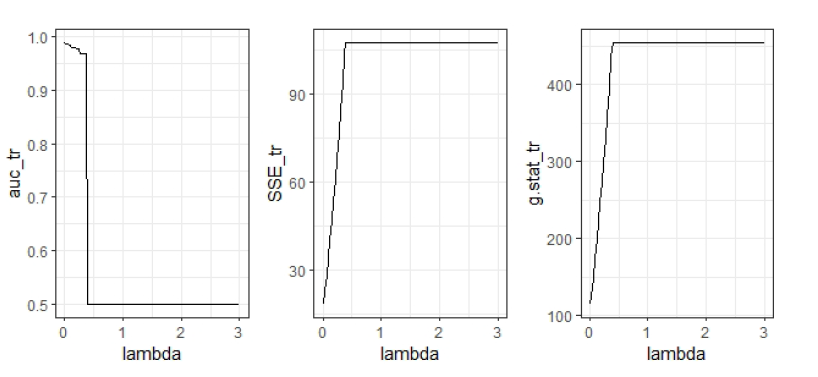

\
\

<link rel="stylesheet" href="style.css">

<h2><b>Projects</b></h2>

<table>
<col width="20%">
<col width="30%">
<col width="50%">

<tr style="border-top:1pt solid black;">
  <th rowspan="3"></a></th>
  <td style="vertical-align: bottom">05/2020</td>
  <td style="text-align:right; vertical-align:bottom">Satistical Computing Class</td>
</tr>
<tr>
  <td colspan="2" style="height:20px; vertical-align:middle"><h3><b>A Bayesian model of hurrican trajectories</b></h3></td>
</tr>
<tr>
  <td colspan="2">
  
  * <a href="./files/report4.pdf"><i style="font-size:24px" class="fa">&#xf1c1;</i></a>
  
  
  * Implemented coordinatewise Metropolis–Hastings Sampling algorithm and sampled from the posterior distribution to get stable Markov Chain (No package used). 
  
  * Estimated parameters and the numerical standard error and constructed the 95% CI base the results of Markov Chain.
  
  * Used the estimated parameters to predict other hurricane speed.</td>
  
</tr>

<tr style="border-top:1pt solid black;">
  <th rowspan="3"></a></th>
  <td style="vertical-align: bottom">04/2020</td>
  <td style="text-align:right; vertical-align:bottom">Satistical Computing Class</td>
</tr>
<tr>
  <td colspan="2" style="height:20px; vertical-align:middle"><h3><b>Daily COVID-19 Cases Prediction model Across Nations</b></h3></td>
</tr>
<tr>
  <td colspan="2">
  
  * <a href="./files/report3.pdf"><i style="font-size:24px" class="fa">&#xf1c1;</i></a>
  
  * Trained logistic curve model to fit the COVID-19 cases data
  
  * Estimated the coefficients parameters of logistic curve model by using the Adam algorithm (No package used) and visualized data

  * Used Mixed Gaussian Model performed by EM algorithm to cluster the estimated parameters of each nation </td>
  
</tr>

<tr style="border-top:1pt solid black;">
  <th rowspan="3"></a></th>
  <td style="vertical-align: bottom">03/2020</td>
  <td style="text-align:right; vertical-align:bottom">Satistical Computing Class</td>
</tr>
<tr>
  <td colspan="2" style="height:20px; vertical-align:middle"><h3><b>A Bayesian model of hurrican trajectories</b></h3></td>
</tr>
<tr>
  <td colspan="2">
  
  * <a href="./files/report2.pdf"><i style="font-size:24px" class="fa">&#xf1c1;</i></a>
  
  
  * Implemented coordinatewise Metropolis–Hastings Sampling algorithm and sampled from the posterior distribution to get stable Markov Chain (No package used). 
  
  * Estimated parameters and the numerical standard error and constructed the 95% CI base the results of Markov Chain.
  
  * Used the estimated parameters to predict other hurricane speed.</td>
  
</tr>

<tr style="border-top:1pt solid black;">
  <th rowspan="3"></a></th>
  <td style="vertical-align: bottom">05/2020</td>
  <td style="text-align:right; vertical-align:bottom">Satistical Computing Class</td>
</tr>
<tr>
  <td colspan="2" style="height:20px; vertical-align:middle"><h3><b>A Bayesian model of hurrican trajectories</b></h3></td>
</tr>
<tr>
  <td colspan="2">
  
  * <a href="./files/report4.pdf"><i style="font-size:24px" class="fa">&#xf1c1;</i></a>
  
  
  * Implemented coordinatewise Metropolis–Hastings Sampling algorithm and sampled from the posterior distribution to get stable Markov Chain (No package used). 
  
  * Estimated parameters and the numerical standard error and constructed the 95% CI base the results of Markov Chain.
  
  * Used the estimated parameters to predict other hurricane speed.</td>
  
</tr>

