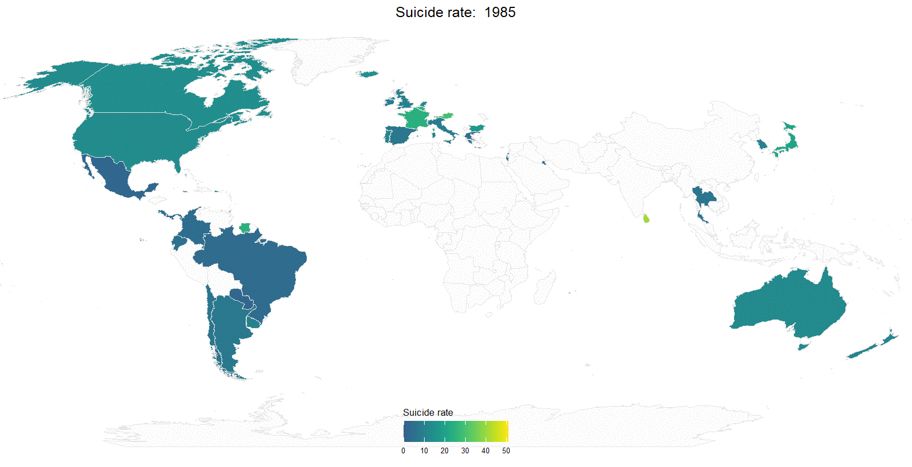

```{r setup, include=FALSE}
knitr::opts_chunk$set(message = F,warning = F)
library(tidyverse)
library(readxl)
library("scales")
```

# LDA data with different event symbols 
```{r,echo = F}
data=read_excel("./data2/BIOCARD CSF_Lumipulse Data with dates_081320AM_MA.xlsx") %>% select(study_id,dob,date,AB42AB40)

data=data %>% mutate(
  time=(date-dob)/365
) %>% select(-date,-dob) %>% arrange(study_id)

background_ori=get(load("./data2/EDA.RData")) 
data_delete_ori=data %>% filter(study_id != 18) %>% arrange(study_id)


data_delete=data_delete_ori %>% filter(time>=55)
background=background_ori %>% filter(event_time>=55)

c=background$subject_id
d=unique(data_delete$study_id)
overlap=intersect(c,d)

data_delete=data_delete %>% filter(study_id %in% overlap)
background=background %>% filter(subject_id %in% overlap)

bar_name_follow=background %>% select(subject_id,event_time,event) %>% mutate(
  follow_up=event_time-55
)

bar_name_follow$new_study_id=rank(bar_name_follow$follow_up,ties.method="random")

ori_index=bar_name_follow$subject_id
new_id=NULL
for(i in 1:length(ori_index)){
  rows=which(data_delete$study_id==ori_index[i])
  new_id=c(new_id,rep(as.numeric(bar_name_follow[i,5]),length(rows)))
}
bar_name_follow=bar_name_follow %>% arrange(new_study_id)
data_delete$new_id=new_id

data_delete_final=data_delete %>% mutate(
  time=as.numeric(time-55))

# compare the data_delete_final$time and bar_name_follow
value=list()
for(i in 1:nrow(bar_name_follow)){
value[[i]]=as.tibble(data_delete_final %>% filter(new_id==i))}

value2=list()
for(w in 1:nrow(bar_name_follow)){
  value2[[w]]=value[[w]] %>% filter(time<=as.numeric((bar_name_follow[w,4])))
  
  }

fina_value=NULL
for(i in 1:nrow(bar_name_follow)){
  fina_value=rbind(fina_value,value2[[i]])}

```


```{r,echo = T}

  p=ggplot() + geom_bar(data=bar_name_follow,aes(x=new_study_id, y = follow_up),stat = "identity",fill="#BEBEBE")+theme_minimal()+scale_y_continuous(breaks=c(0,10,20,30,40,50), labels = c(0,10,20,30,40,50)+55)+ 
    coord_flip() +
    geom_point(data=fina_value,aes(x =new_id, y = time, group=new_id,fill=AB42AB40,colour = AB42AB40),shape = 18, size = 1)+labs(title="AB42AB40 change with follow_up time in subjects",x="study id",y="Age")
  
  
 p_base=p+scale_fill_gradientn(colours=c("lightgreen","yellow","red", "blue",
                                 "darkblue",
                                 "black"),
                       values=rescale(c(0.04,0.06,0.08, 0.1, 0.12)),
                       guide="colorbar",breaks= c(0.04,0.06,0.08, 0.1, 0.12),
                       labels = c("0.04","0.06","0.08","0.1","0.12"))+
  scale_color_gradientn(colours=c("lightgreen","yellow","red", "blue",
                                 "darkblue",
                                 "black"),
                       values=rescale(c(0.04,0.06,0.08, 0.1, 0.12)),
                       guide="colorbar",
                       breaks= c(0.04,0.06,0.08, 0.1, 0.12),
                       labels = c("0.04","0.06","0.08","0.1","0.12"))
  
```


```{r,fig.height = 8, fig.width = 7, fig.align = "center"}
bar_name_follow=bar_name_follow %>% mutate(event=factor(event))
p_base+geom_point(data=bar_name_follow,aes(x=new_study_id, y = follow_up,shape=event),size=0.8,stroke = 0.2)+scale_shape_manual(values = c(3,0,1))
```

# Dynamic World map
```{r, include=FALSE}
library(tidyverse)
library(countrycode)
library(gganimate)
library(rworldmap)
library(rgdal)
#library(rgeos)
```


```{r,echo = F}
world <- read_csv("./data/master.csv")
world_clean <-
  world %>% 
  rename( "rate_standardized" = "suicides/100k pop") %>% 
  mutate(suicides = population * rate_standardized) %>% 
  group_by(country,year) %>% 
  summarise(rate = sum(suicides)/sum(population))

# get Min and Max values of suicide rate
vmax <- world_clean %>% pull(rate) %>% max(na.rm=T)
vmin <- world_clean %>% pull(rate) %>% min(na.rm=T)
```

```{r,echo = F}
world_clean <-
  world_clean %>% 
  mutate(
    'country_iso3c' =   countrycode(country,'country.name', 'iso3c')
  ) 
```

```{r,echo = F}
wmap <- 
  getMap(resolution="low") %>% 
  spTransform(CRS("+proj=robin"))
  
# get centroids of countries
centroids <- 
  rgeos::gCentroid( wmap , byid = TRUE, id = wmap@data$ISO3) %>% 
  data.frame()
  
data.table::setDT(centroids, keep.rownames = TRUE)
data.table::setnames(centroids, "rn", "country_iso3c")
```

```{r,echo = F}
wmap_df <- 
  fortify(wmap, region = "ISO3") %>% 
  left_join(world_clean, by = c('id' = 'country_iso3c')) %>% 
  left_join(centroids, by = c('id'='country_iso3c'))
```

```{r,echo = T}
# plot
world_plot <- 
  ggplot(data = wmap_df) +
  geom_polygon(aes(x = long, y = lat, group = group, fill = rate, frame = year),color = "gray90") +
  viridis::scale_fill_viridis(name = "Suicide rate", begin = 0.3, end = 1,limits = c(vmin,vmax), na.value = "gray99") +
  theme_void() +
  guides(fill = guide_colorbar(title.position = "top")) +
        labs(title = "Suicide rate: ") +
        theme(plot.title = element_text(hjust = 0.5, vjust = 0.05, size=25)) +
        theme(plot.caption = element_text(hjust = 0, color = "gray40", size=15)) +
        coord_cartesian(xlim = c(-11807982, 14807978)) +
        theme( legend.position = c(.5, .08), 
               legend.direction = "horizontal", 
               legend.title.align = 0,
               legend.key.size = unit(1.3, "cm"),
               legend.title = element_text(size = 17), 
               legend.text = element_text(size = 13) )

# 
#gg_animate(world_plot, title_frame =T, 
        #     ani.width = 1600, ani.height = 820, dpi = 800, interval = .4)      
```
